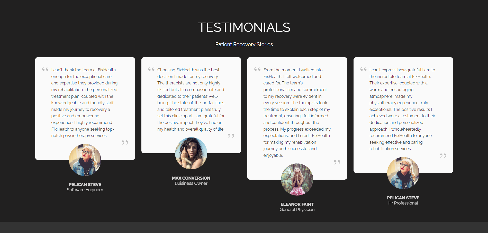
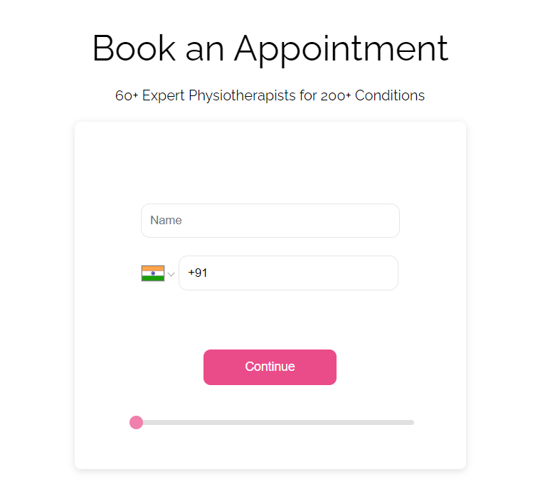
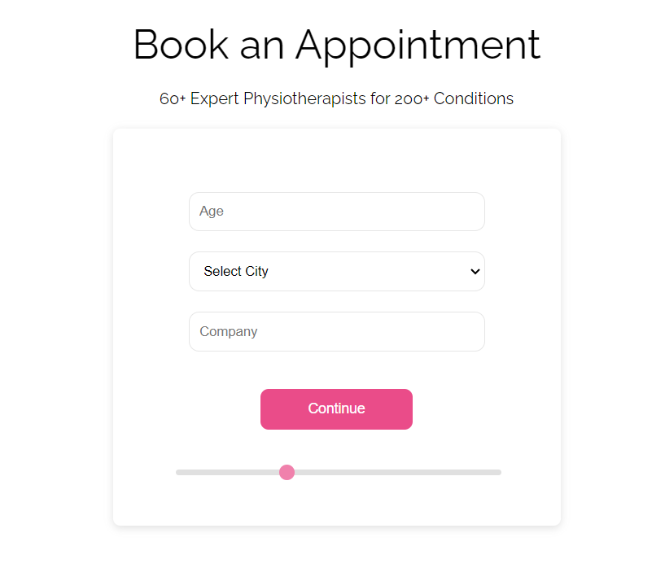
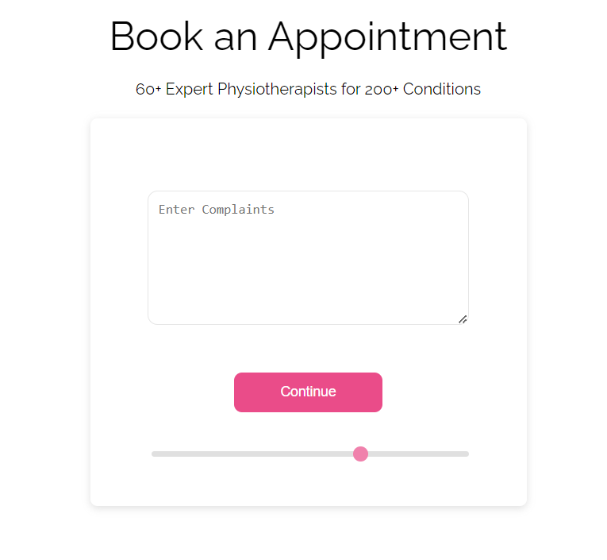
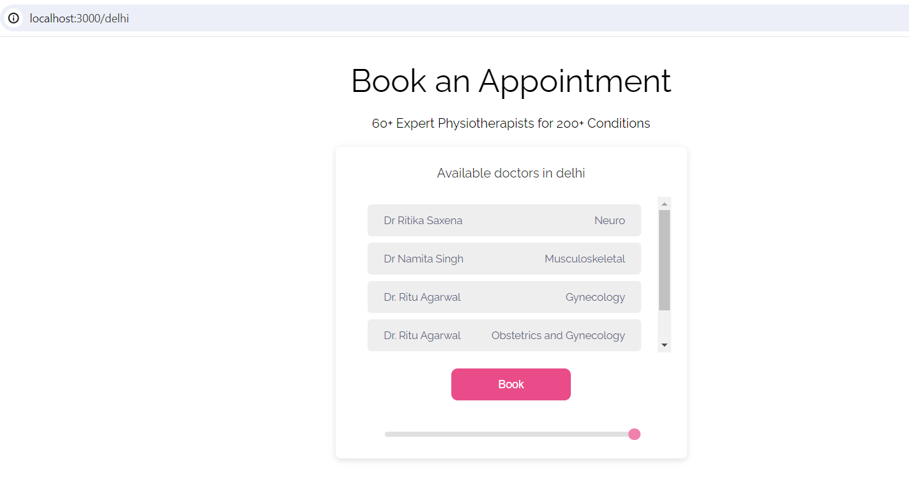
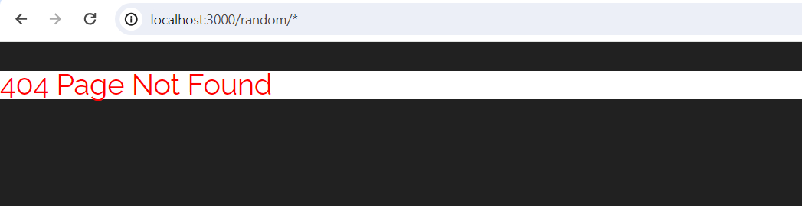

# Available Scripts

In the project directory, you can run:

### `npm start`

Open [http://localhost:3000](http://localhost:3000) to view it in the browser.

# Features

- # Dark Mode
  ### click on the toggle icon to switch to dark mode
 
 
- # Book Appointment
  - ## Complete Step 1
    ### Fill your name and Phone number
    
  - ## Complete Step 2
    ### Fill your age, city and company
    
  - ## Complete Step 3
    ### Explain your complaints
    
  - ## Complete Step 4
    ### Listing available doctors in your city
    
- # Redirect
  ### If you redirect navigation to a particular city directly, it will show list of available doctors for that city.
  
- # Error Page
    ### If you hit any other url, that do not contain a city name, it  will give 404 page not found
    

